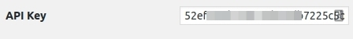
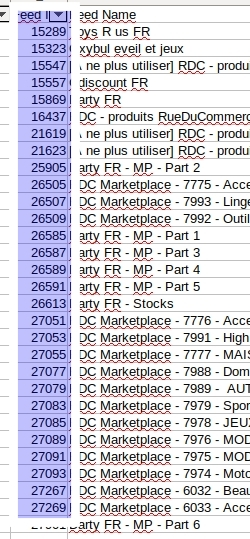

# How to configure Awin datafeeds ?

## API Key

  
Follow this Awin doc to find it:
[Awin Doc](https://wiki.awin.com/index.php/API_authentication)

## Awin Partner Code
 This is the program
feed ID you're onrolled on.  
[Awin Doc ](https://wiki.awin.com/index.php/Product_Feed_List_Download)  
To Find it, Log in your Awin account then in the menu Links and Tools
--> Create-a-Feed.  
You'll find a link giving a csv file. Open it and find the Feed ID
you're looking for.  
  
Copy in the field all the partner Feed ID you want separated by a comma.

## Awin Partner Logo
For each partner code added, an input field will appear after saving
change.  
Simply upload a logo in your WordPress Media Library then copy and paste
the URL.

## Awin Trademark Code
On certain partner, you should find some trademark, you know you won't
work with so... why adding their product in the field?!  
The simplest way to find these codes is to create a data feed link
[Awin Doc](https://wiki.awin.com/index.php/Downloading_feeds_using_Create-a-Feed)  
Create Your Feed and in the URL given, copy the codes after the '/bid/'
part.  
**Example**: On this URL
https://productdata.awin.com/datafeed/download/apikey/##APIKEYHIDDEN##/language/fr/fid/15557/bid/50661,63245,65619,67963/columns/aw_deep_link,product_name,aw_product_id,merchant_product_id,merchant_image_url,description,merchant_category,search_price,merchant_name,merchant_id,category_name,category_id,aw_image_url,currency,store_price,delivery_cost,merchant_deep_link,language,last_updated,display_price,data_feed_id/format/csv/delimiter/%2C/compression/gzip/adultcontent/1/  
Simply copy & paste 50661,63245,65619,67963

You can of course customize each trade mark for each partners.

## Awin Customer Code
You'll find it on your Awin Dashboard in top right near your name.

## Cron Schedule
Each day, this plugin will download and extract in the database all
products from the feeds. It can take times... depends on hao many
partners, trademark and products to store in DB.

You're ready !

## AAWP templates
If your using [AAWP](https://getaawp.com/), you can copy the aawp folder
from the plugins to your child themes to customize them without loosing
customizations on future updates.  
If you already customized AAWP templates (You already have a aawp folder
in your folder theme) then, add this line where ever you want to see
partner prices:  
do_action( 'thfo_compare_after_price', $this );
or [contact me](https://www.thivinfo.com/en/add-a-ticket/)
